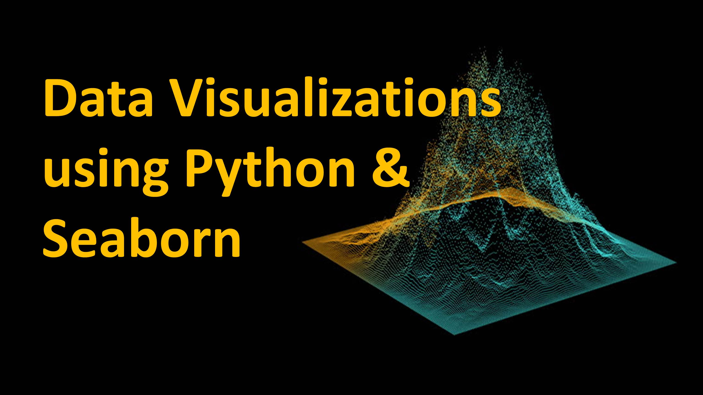

<!--
**vasja34/vasja34** is a ✨ _special_ ✨ repository because its `README.md` (this file) appears on your GitHub profile.

Here are some ideas to get you started:

- 🔭 I’m currently working on ...
- 🌱 I’m currently learning ...
- 👯 I’m looking to collaborate on ...
- 🤔 I’m looking for help with ...
- 💬 Ask me about ...
- 📫 How to reach me: ...
- 😄 Pronouns: ...
- ⚡ Fun fact: ...
-->

<h1 align="center">Hi there 👋, I'm Vadim Moldavsky!</h1>

## Personal Details

*I'm a resourceful professional with more than 10 years of experience and a solid background in Applied Math, Statistics, High-Performance Computing, Signal Processing, Machine Learning, Data Science, Data Visualization, System Design, Extensive Simulations, Analysis and Troubleshooting.*

- ***My Slogan: while !(succeed = try())***

- **My Core Expertise**: Signal & Image Processing, Applied Math, Statistics, Machine Learning, AI, Data Mining, Global Optimizations, Code Acceleration, Matlab Compiler, Real-Time Simulations, 
Many-Objective Optimizations, Evolutionary Programming, Self-Programmable Neural Networks

- **My Favorite Frameworks and Libraries**: NumPy, SciPy, Pandas, Scikit-learn, Matplotlib, Seaborn, XGBoost, LightGBM, CatBoost, Qt6, PySimpleGUI, gbm, RandomForest, Weka, GMDH-NN, JAMA, Weka, jMetal, ECJ, Opt4J, etc.

- **My Favorite Computer Languages**: MATLAB, Python, R, Julia 

- I’m interested in open and reproducible science, scientific visualization, and computer graphics.

- My hobby is Books, Art, Literature, Poetry, Philosophy, and Theater.

- I speak, read and write in Hebrew, English, and Russian

## Some of My Works

| Name                  | Description                                            |
| ----------------------|------------------------------------------------------- |
| _[Chat-Rooms-Project](https://github.com/vasja34/Chat-Rooms-Project)_            | Chat Rooms is an asynchronous TCP/IP app based on the PySimpleGUI framework           |
| _[Python-Visualization](https://github.com/vasja34/Python-Visualization)_                          | A Python Visualization Tutorials & Demos: Matplotlib, Seaborn, Bokeh   |
| _[Python-Roadmap](https://github.com/vasja34/Python-Roadmap)_                          | The Best Python frameworks, libraries, software and resources     |
| _[Stopwatch-Demo](https://github.com/vasja34/Stopwatch-Demo)_                          | The simple application of stopwatch with lap button     |
| _[YouTube-Downloader](https://github.com/vasja34/YouTube-Downloader)_                    | YouTube Video Downloader.                                                              | 
| _[Scikit-Notebooks](https://github.com/vasja34/Scikit-Notebooks)_                          | An overview of how to use scikit-learn                       |
<!--| _[Python-in-Science-and-Engineering](https://github.com/vasja34/Python-in-Science-and-Engineering)_                    | A collection of examples of using python in the kinds of scientific and engineering computations                     |
 | _[Local2Internet](https://github.com/KasRoudra/Local2Internet)_                | Expose locally hosted website into all over internet.           |  -->

## Languages and Tools

  
  
  
  
  
   <!--&nbsp;-->
  
  
  

## Just Gifs 

  
  

## Useful Links

- **[Machine learning recipes](https://github.com/rougier/ML-Recipes)** Self-contained machine learning Python recipes. 
- **[Glumpy](https://glumpy.github.io/gallery.html)** is a python library for scientific visualization that is both fast, scalable and beautiful. 
- **[VisPy](https://github.com/vispy/vispy)** is a high-performance interactive 2D/3D data visualization library. 
- **[Matplotlib 3D](https://github.com/rougier/matplotlib-3d)**  provides a better and more versatile 3d axis for Matplotlib. 
- **[SVG lib](https://github.com/rougier/svg-lib)** A library to create and display SVG tags, progress bars and icons. 

## Art... or Science

   

    

<!--
<

-->

## 
- **[Recursive Voronoi](https://github.com/rougier/recursive-voronoi)** Recursive voronoi using shapely, matplotlib and scipy.
- **[Pendulum](https://github.com/rougier/pendulum)** Animated double pendulum using matplotlib.
- **[Wind map](https://github.com/rougier/windmap)** Animated streamlines using matplotlib.
- **[Alien life](https://github.com/rougier/alien-life)** A remake (using matplotlib) of the beaufitul animation by Necessary Disorder.
- **[Anatomy of a figure](https://github.com/rougier/figure-anatomy)** shows and names the main elements of a matplotlib figure.
- **[Calendar heatmap](https://github.com/rougier/calendar-heatmap)** Display your yearly GitHub activity using matplotlib.
- **[Less is More](https://github.com/rougier/less-is-more)** A remake of the animation by Darkhorse Analytics (using matplotlib, what else?).

### Contact me:

